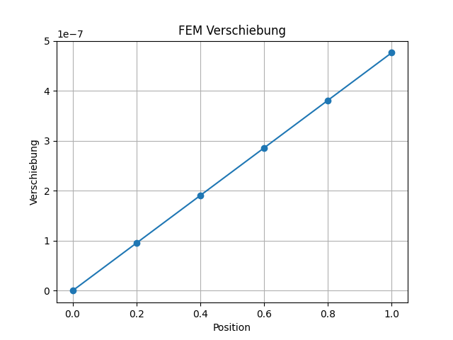

# FEM Example (Python)

A simple Finite Element Method (FEM) example for a 1D bar.

## Result


## Features
- FEM assembly
- Linear system of equations
- Visualization using matplotlib

## Getting Started
```bash
pip install -r requirements.txt
python main.py
